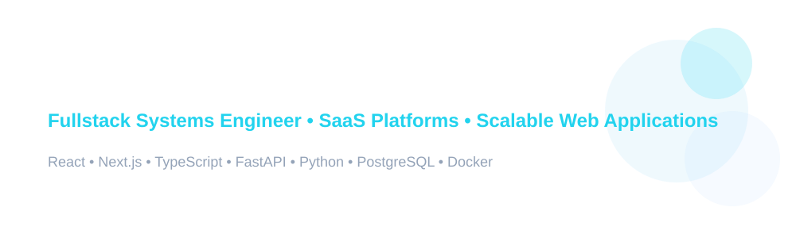

<!-- HERO -->

  

<h2 align="center">🧠 What I Do</h2>

I design and build **fullstack systems** — from frontend architecture to backend APIs and client-facing dashboards.

Most of my work revolves around **SaaS-style products, internal tools, and scalable web platforms**.

I also provide clients with a **Notion-based project dashboard**, so they can track:
- progress in real time
- feature delivery stages
- design + development updates
- roadmap visibility without technical noise

<h3 align="center">⚡ Core Focus</h3>

- Fullstack SaaS applications (frontend + backend + database)
- Scalable frontend architecture systems
- Backend APIs and service design
- Real-time or dashboard-driven applications
- Developer experience + maintainability-first systems

<h2 align="center">🚀 Tech Stack</h2>

### ⚛️ Frontend Systems

### 🔧 Backend Systems

### 🧪 DevOps & Quality

<h2 align="center">📫 Contact</h2>

- GitHub: [https://github.com/Aria-Abadian](Aria-Abadian)
- LinkedIn: [Aria-Abadian](https://www.linkedin.com/in/aria-abadian/)
